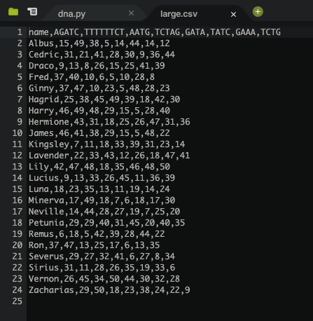
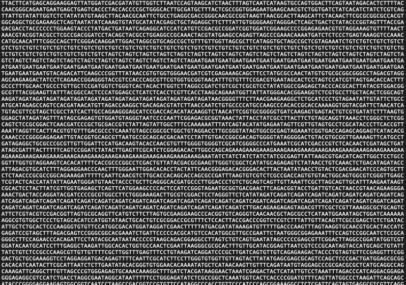
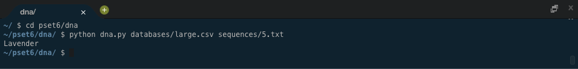

# **DNA Analysis Tool**

# Description
A pure Python application that profiles DNA sequences against a database full of people using an algorithm I created, and returns a match if there is one.

For a scientific explanation of DNA profiling and better understanding of the program, please see [this](https://cs50.harvard.edu/x/2020/psets/6/dna/#background). One use of this technology is in the profiling of suspects used by the FBI via their [CODIS DNA database](https://www.fbi.gov/services/laboratory/biometric-analysis/codis/codis-and-ndis-fact-sheet).

As someone who really digs science and technology and the benefits it brings to society, I had a lot of fun making this [Harvard CS50 project](https://cs50.harvard.edu/x/2020/psets/6/dna/).

Pictures of the application are below. Click them for larger versions.

#

# Project Files
The following links contain summary overviews of each file used in the project. Please refer to a file's code directly for specific implementation and details regarding that file.

* [dna.py](#dna.py)
* [database.csv](#database.csv)
* [sequences.txt](#sequences.txt)

## dna.py
This is the file that does all of the analyzing. It opens .csv and .txt files and contains functions that make comparisons between people's partial DNA and full DNA sequences.

## database.csv
Any file with a .csv extension is a file with a database of people's names and their DNA [STRs](https://cs50.harvard.edu/x/2020/psets/6/dna/#background). These files are used as comparisons to individual DNA sequences in dna.py.

## sequences.txt
Any file that has a .txt extension is an individual DNA sequence. These are parsed in dna.py and compared to database .csv files.

# License & Copyright
© Alex Guidace

Licensed under the [MIT License](License).
